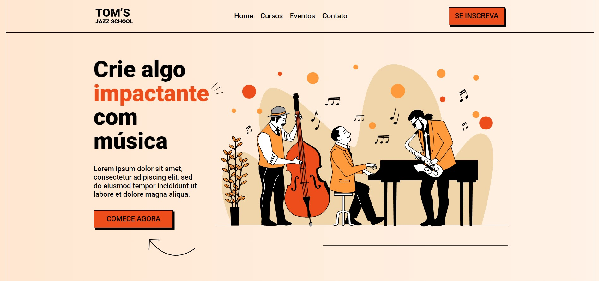

 

<h1 align="center">Tom's Jazz School</h1>

<!-- ABOUT THE PROJECT -->
## Sobre esse projeto

O Tom's Jazz School é uma landing page de cursos de jazz. Foi criada na intenção de melhorar minhas habilidades com layouts responsivos.

### Criado com:

Ferramentas:  

1. HTML5
2. CSS3

<!-- GETTING STARTED -->
## Visualizar 

### Pré-visualização

Você pode visualizar o site clicando no link abaixo.

[Ver site](https://ericodesenvolvedor.github.io/toms-jazz-school/)

### Figma

Você pode visualizar o figma do projeto clicando abaixo

[Ver figma](https://www.figma.com/file/76GJ4uK7PyKeAo6dcpVyjA/Tom's-Jazz-School?node-id=0%3A1&t=VTeJv2u21v8jkayO-1)

<!-- CONTACT -->
## 📫 Contato

Instagram - [@ericodesenvolvedor](https://instagram.com/ericodesenvolvedor/)

Linkedin: [Eric Oliveira](https://www.linkedin.com/in/eric-de-oliveira-pereira/)